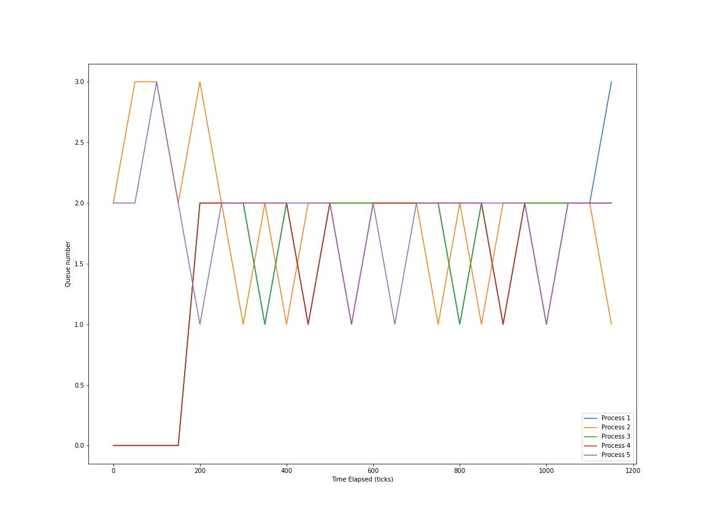

# Enhanced xv6
## Overview
In this project some new features were added to the xv6 operating system.
- waitx (system call) Returns the runtime and the wait time of the process it is called on (same functionality as wait).
- ps (user program) Displays all running processes and information on the terminal window. 
- schedulers 
	* The schedulers added were RR (Round Robin inbuilt), FCFS (First Come First Serve), PBS (Priority Based Scheduling) and MLFQ (Multi Level Feedback Queue).
	* To utilize a scheduler while compiling the kernel, simply add ```SCHEDULER=TYPE``` to the make command where TYPE represents the abbreviation for the scheduler type.

## Boot the OS
Since the OS is very primitive and we want to be able to test it, we will use a virtualizer (QEMU). This allows us to emulate the OS while booted into another OS. Simply run the command  
```
make qemu SCHEDULER=<TYPE>
```
to start up the OS in a seperate qemu window. If the scheduler is not specified the default scheduler will be used (RR).

## waitx
The wait system call only waits for a child process to exit and deallocates its resources. The waitx system calls builds on this and also returns the runtime and the waiting time of the child process. 
```
int 
waitx(int *wtime, int *rtime)
{
	...
      
        #ifdef MLFQ
        dequeue(p, p->queue_number);
        #endif
     
        *rtime = p->rtime;
        *wtime = p->wtime;

    ...
}
```
The ellipsis represent the rest of the wait system call. The lines mentioned were added to set the values to be returned.  
To allow the return of these values, the following values were added to the process structure :  
- ```ctime``` - The creation time of the process, this value is set in ```allocproc()```. 
- ```etime``` - The end time of the process, this value is set in ```exit()```
- ```rtime``` - The run time of the process, this value is updated whenever a timer interrupt is received in ```trap()```
- ```wtime``` - The time that a process spends waiting for a CPU. We calculate this by checking whenever there is a change in state from ```RUNNABLE``` to any other state. 
- ```made_runnable``` - The time when the state of the process changed to ```RUNNABLE```. This is mainly used to calculate wait time. 
Each of these times are recorded in the 'ticks' unit which represents the inbuilt timer of the xv6 OS.

## ps
This user command was implemented to help list the current running processes. To implement the user command, a syscall was made and a seperate file was made to allow the user to use this syscall.  
```
int ps()
{
	cprintf("PID \t PRIORITY \t STATE \t\t R_TIME \t W_TIME \t N_RUN \t CUR_Q \t Q0 \t Q1 \t Q2 \t Q3 \t Q4\n\n");

	for(struct proc *p = ptable.proc; p<&ptable.proc[NPROC]; p++)
	{
		if(p->state == UNUSED)
			continue;
		int wtime = ticks - made_runnable;

		cprintf("%d \t %d \t\t %s \t ", p->pid, p->priority, states[p->state]);
		cprintf("%d \t\t %d \t\t %d \t %d \t ", p->rtime, wtime, p->rounds, p->queue_number);
		cprintf("%d \t %d \t %d \t %d \t %d\n", p->ticks[0], p->ticks[1], p->ticks[2], p->ticks[3], p->ticks[4]);
	}

  return 0;
}
```
Here we simply iterate over the process array, and if they have been allocated we display their information. 

## Schedulers
Three alternative schedulers have been implemented. The default scheduler is Round Robin, and the other schedulers are invoked using the SCHEDULER flag during compile time.  

### First Come First Serve
To compile the kernel using the FCFS scheduler, simply run the commands
```
make clean
make qemu SCHEDULER=FCFS
```
The FCFS is simply non preemptive, so we remove the ```yield()``` call in the interrupt function so that the process currently using the CPU will not be preempted.  
#### Code Breakdown
```
struct proc *chosen = 0;

for(struct proc *p = ptable.proc; p<&ptable.proc[NPROC]; p++)
{
  if(p->state != RUNNABLE)
    continue;
  if(chosen == 0 || p->ctime < chosen->ctime)
    chosen = p;
}
```
Here we simply iterate over the process array, and choose the process that is runnable and has minimum creation time. The FCFS scheduling algorithm always chooses the process that was created first.  

```
if(chosen != 0 && chosen->state == RUNNABLE)
{
  c->proc = chosen;
  switchuvm(chosen);
  chosen->state = RUNNING;

  chosen->rounds++;
 
  swtch(&(c->scheduler), chosen->context);

  switchkvm();

  c->proc = 0;
}
```
If a process that is runnable was chosen, we switch to process virtual memory to let the process run. After the process has finished running in the CPU (or has gone to sleep) we switch back to kernel space and invalidate the current process running in the CPU, getting ready for the next one.

### Priority Based Scheduling
To compile the kernel using the PBS scheduler, simply run the commands
```
make clean
make qemu SCHEDULER=PBS
```
For the priority based scheduling algorithm, a new entry had to be appended to the process structure. Each process now has a priority (default 60) that ranges from 0 to 100, 0 indicating the highest priority. This scheduler is preemptive, and emulates the behavior of Round Robin scheduling for processes with the same priority. To test this scheduler a new system call to set priority has been added. 

#### Code Breakdown
```
int min_priority = -1;

for(struct proc *p = ptable.proc; p<&ptable.proc[NPROC]; p++)
{
  if(p->state != RUNNABLE)
    continue;

  if(min_priority == -1 || min_priority >= p->priority)
    min_priority = p->priority;
}

if(min_priority == -1)
{
  release(&ptable.lock);
  continue;
}
```
Here we try and find runnable processes with minimum priority. If no such process is found, we simply restart the scheduler.  

```
for(struct proc *p = ptable.proc; p<&ptable.proc[NPROC]; p++)
{
  int reset = 0;

  for(struct proc *temp = ptable.proc; temp<&ptable.proc[NPROC]; temp++)
    if(temp->priority < min_priority && temp->state == RUNNABLE)
      reset = 1;
  
  if(reset)
    break;

  if(p->state != RUNNABLE)
    continue;

  if(p->priority == min_priority)
  {
    c->proc = p;
    switchuvm(p);
    p->state = RUNNING;

    p->rounds++;

    swtch(&(c->scheduler), p->context);
    switchkvm();

    c->proc = 0;
  }
}
```
Now since we've found the minimum priority present in the process array, we iterate over the process array and try to find processes with priority equal to the minimum priority. Before trying to find a process with the minimum priority, we check if any priority has been updated to be lower than the old minimum. If a new minimum is found, we break and restart the scheduler. If the minimum that we found earlier is still valid, then we find runnable processes in the process array with the same priority, and repeat the swapping procedure.  
#### set_priority(int new_priority, int pid);
```
if(new_priority<0 || new_priority>100)
    return -1;

int old_priority = -1;
int release_CPU = 0;

for(struct proc *p = ptable.proc; p<&ptable.proc[NPROC]; p++)
{
	if(p->pid == pid)
	{
		acquire(&ptable.lock);
		old_priority = p->priority;
		p->priority = new_priority;

		if(old_priority > new_priority)
			release_CPU = 1;

		release(&ptable.lock);
		break;
	}
}

if(release_CPU)
	yield();

return old_priority;
```
In this function we iterate over the process array and try to find a process with the same pid as the one we currently have, and update its priority. If the updated priority is lower, then we simply yield the processor in case the new priority is lower than the rest. To give users access to this system call, a setPriority user function was also created that takes 2 command line arguments; the new priority and the pid of the process.  

### Multi Level Feedback Queue
To compile the kernel using the MLFQ scheduler, simply run the commands
```
make clean
make qemu SCHEDULER=MLFQ
```
To implement this scheduler a lot of additional helper functions and variables had to be added.  
To the proc structure, the variables
```
int queue_time;
int queue_number;
int ticks[5];
int cur_ticks;
int exceeded;
```
had to be added. They indicate the time at which the process entered the queue, the queue that the process entered, the time elapsed at the queue its at, the total time elapsed at all 5 queues and a flag to indicate whether the process has exceeded the time limit at that queue.  
The queues also had to be added, along with two methods to add processes to the queues and to remove processes from queues.

```
static struct proc *queue[5][NPROC];
static int num_queued[5] = {0, 0, 0, 0, 0};
```
The first variable is an array of 5 arrays of process structures. The second array holds the number of processes currently in each queue.  

```
int enqueue(struct proc *p, int pos)
{	
	if(p->state != RUNNABLE)
		return -1;
	for(int i = 0; i<num_queued[pos]; i++)
		if(queue[pos][i]->pid == p->pid)
			return -1;
	p->queue_number = pos;
	p->queue_time = ticks;
	queue[pos][num_queued[pos]++] = p;

	return 0;
}

int dequeue(struct proc *p, int pos)
{
  for(int i = 0; i<num_queued[pos]; i++)
	{
		if(queue[pos][i]->pid == p->pid)
		{
			queue[pos][i] = 0;
			for(int j = i; j<num_queued[pos]-1; j++)
			{
				queue[pos][j] = queue[pos][j+1];
			}
			num_queued[pos] -= 1;
			return 0;
		}
	}
	return -1;
}	
```
The above two functions simply add and remove processes from the queue. If the process already exists/doesn't exist the functions simply return -1.  

```
void set_exceeded(struct proc *p)
{
	acquire(&ptable.lock);
	p->exceeded = 1;
	release(&ptable.lock);
}

void update_ticks(struct proc *p)
{
	acquire(&ptable.lock);
	p->cur_ticks += 1;
	p->ticks[p->queue_number] += 1;
	release(&ptable.lock);
}
```
The above functions are called from trap(), and weren't simply put there as ptable and trap are independent. They are used to indicate whether a process has exceeded the time limit at a queue, or if it simply has to indicate that it got to run.  

#### Code Breakdown
```
for(struct proc *p = ptable.proc; p<&ptable.proc[NPROC]; p++)
      if(p->state == RUNNABLE)
        enqueue(p, p->queue_number);

for(int i = 1; i<5; i++)
{
	for(int j = 0; j<num_queued[i]; j++)
	{
		int age = ticks - queue[i][j]->queue_time;
		if(age > MAX_AGE)
		{
			struct proc *p = queue[i][j];
			dequeue(p, i);
			enqueue(p, i-1);
		}
	}
}
```
First we iterate over the process pool, and try and add the processes to the queue. We can simply use queue_number here as the value is 0 by default, and if the process is already present in another queue, it'll be ignored. After we add the new processes, we check the list of current processes and check if they have exceeded the age limit. If they have, we promote them to the queue just above their current queue.  

```
struct proc *p = 0;

for(int i = 0; i<5; i++)
{	
	if(num_queued[i] > -1)
	{
		p = queue[i][0];
		dequeue(p, i);
		break;
	}
}

if(p == 0 || p->state != RUNNABLE)
{
	release(&ptable.lock);
	continue;
}
```
Here we take the first process according to the queue hierarchy. If we couldn't find any process, or the state of that process changed before we could give it CPU time, we release the lock and look for the next process.  

```
p->rounds++;
c->proc = p;

switchuvm(p);
p->state = RUNNING;
	
swtch(&c->scheduler, p->context);
switchkvm();

c->proc = 0;

```
At this point, we know that the process specified can be run, and hence we repeat the same process as the other scheduling algorithms.  

```
if(p->state == RUNNABLE)
{
	if(p->exceeded)
	{
		p->exceeded = 0;
		p->cur_ticks = 0;
		dequeue(p, p->queue_number);
    if(p->queue_number != 4)
			p->queue_number++;
	}
  	else
    	p->cur_ticks = 0;
  	enqueue(p, p->queue_number);
}
else
  dequeue(p, p->queue_number);
```
After the process executes for the limit specified for its particular queue, we check if the process is still runnable. If it is then we demote it to the next queue. This removal and re-addition also helps emulate the round robin scheduling for the fourth queue. If it didn't exceed its time (voluntarily relinquished CPU) then we put it back in the same queue. This feature is easily exploitable as a process can stay in a queue indefinitely by taking only t-1 ticks where t is the upper bound. If the process is no longer runnable we simply remove it from the queue.  

## Testing schedulers
To test the various scheduler, a common benchmark program had to be created. This benchmark program simulates IO and CPU time in a random order. To test how long they took, the time command implemented for waitx was used. The sleep time of the benchmark program would roughly indicate the time taken by the child processes and hence we can use it to compare different algorithms. The sleep time was computed as ```etime - ctime - rtime - wtime```. Although this is prone to error, we will still get a relative indication.   

### Round Robin
The RR scheduler switches processes every tick. This overhead in the number of context switches will be reflected in the run time. However running another process while the benchmark program was running (used ps here) was smooth, as it got time slices intermittently. 
```
Sleep : 1317
```

### First Come First Serve
The FCFS scheduler doesn't preempt processes. This means that the number of context switches is very low, and hence total run time will be low, but the processes response time is very long. If we try and run another process while the benchmark process is running, it will wait for the previous processes to terminate. This is not a desirable property in an operating system (no multiprogramming).
```
Sleep : 1260
```

### Priority Based
The priority based scheduler is intended to work when we have 'urgent' and 'non urgent' tasks. To simulate this, priorities were simply assigned (99 to odd processes and 100 to even processes). The round robin scheduling algorithm was used between processes that had the same priority. We should observe performance close to RR scheduling. However, this is not the optimum way to use the priority based scheduler and assigning priorities was not a concern during development. Commands introduced during the execution of the benchmark command work normally. 
```
Sleep : 1369
```

## Multi Level Feedback Queue
The multi level feedback queue works best when there's a wide spread of types of processes. Since all the processes in our example are similar, we don't see the benefits of MLFQ. Running a new process works normally. The MLFQ scheduler is designed to filter processes that have short CPU bursts, and grant them CPU time frequently. 
```
Sleep : 1359
```

## Plotting movement of processes between queues
To visualize the movement between queues, the following code was used in the scheduler. 
```
if(ticks > temp*50)
{
	ps();
	temp += 1;
}
```
This ensures that every 50 ticks, ps is called. The output of the program was redirected to a file called temp. From temp all the redundant lines were removed and python was used to parse the strings. The code for this in ipynb format is named ```Plotting_MLFQ.ipynb```. 

